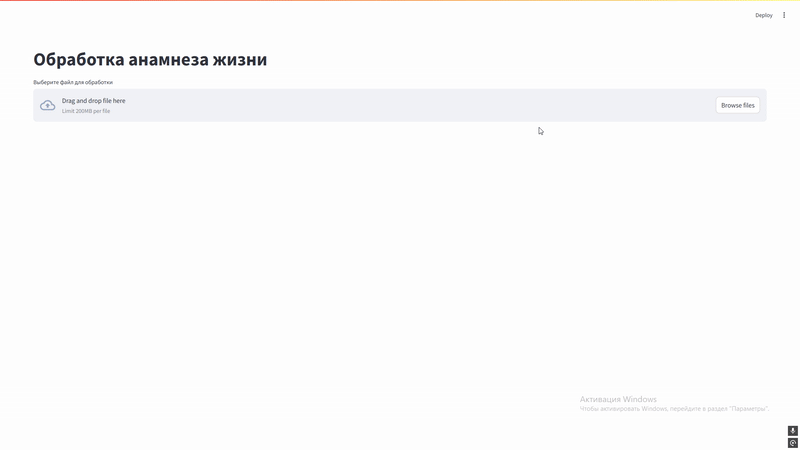
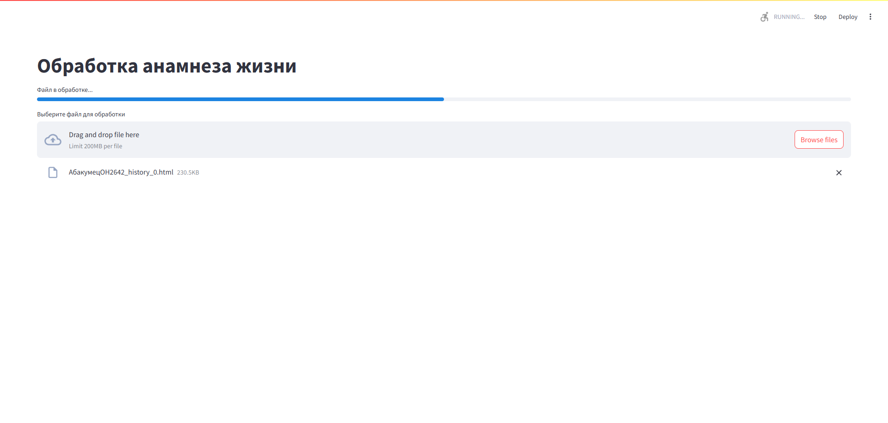
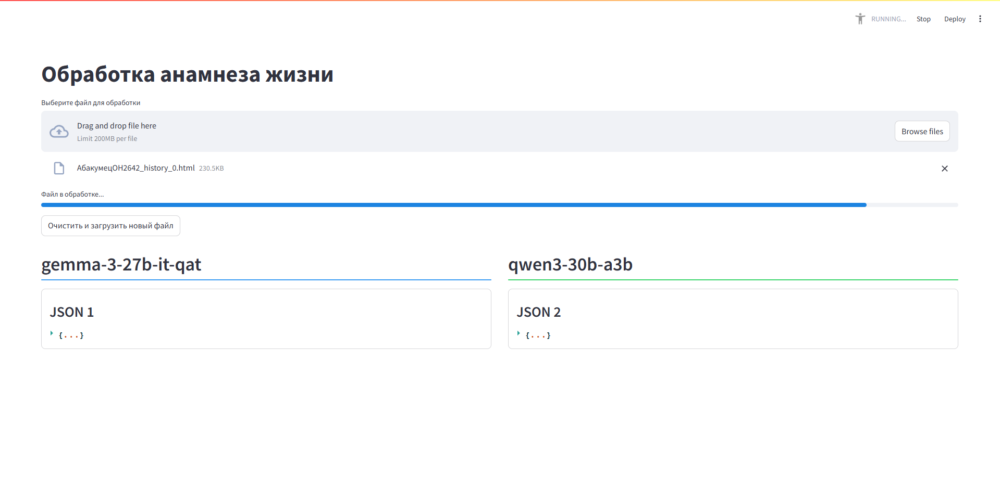
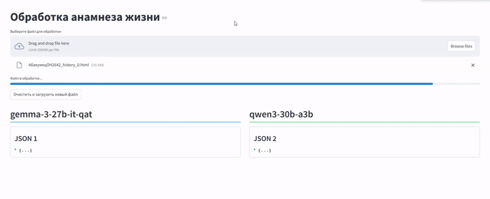
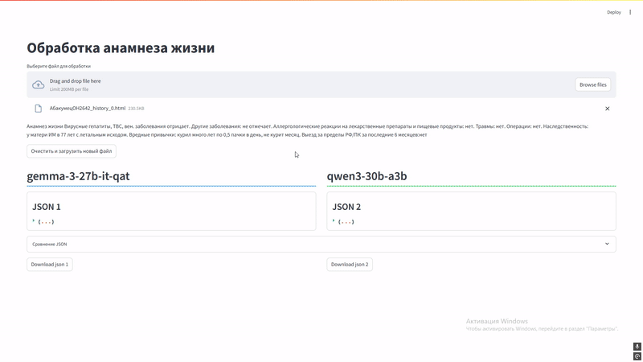
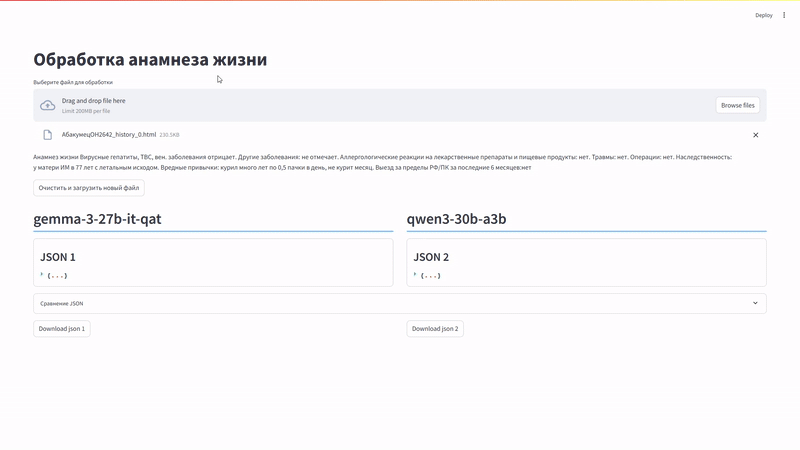
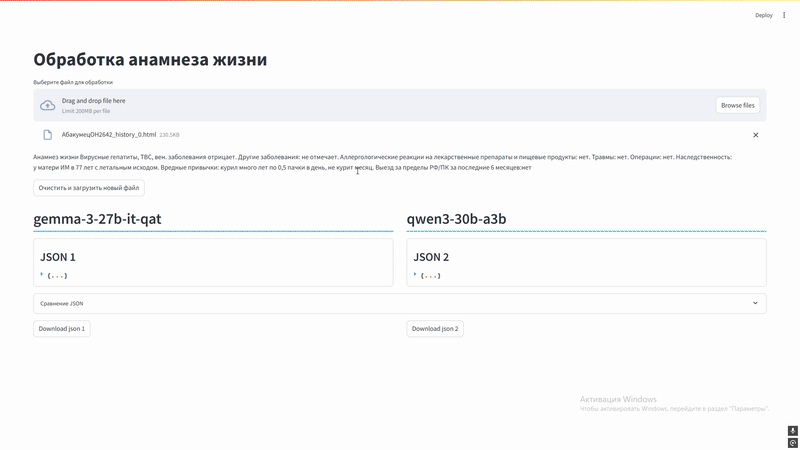

# Обработка анамнеза жизни

Суть этой системы заключается в обработке медицинской истории пациента. При загрузке файла система получает анамнеза жизни оттуда 
и формирует платформоориентированное JSON представление для загрузки на платформу [IACPaaS](https://iacpaas.dvo.ru/)

Система работает с двумя различными LLM для сравнения результатов обработки

[]()
[]()

## 🚀 Быстрый старт

### Требования
Все необходимые пакеты указаны в requirements. Для запуска и работы сервиса достаточно будет корневого файла, 
но в случае если вы захотите дообучить модель, можете также установить training_llm/requirements.txt

Для корректного результата рекомендуется использовать модель `gemma-3-27b-it-qat`

#### 🚨 ВНИМАНИЕ 🚨
Система настроена на работу через OpenAI. Для полноценной работы сервиса необходимо установить и запустить модель через
`Lm-studio`, `Ollama` или другие платформы с подключением через openai


### Установка
```bash
git clone https://github.com/ElerGard/AI_Med_Analyzer.git
cd AI_Med_Analyzer
pip install -r requirements.txt
```

Чтобы у вас правильно сформировался json для платформы IACPaaS, необходимо заполнить `config.py`

```python
class LLM_Settings:
    BASE_URL = "Адрес для openai к моделям"
    API_KEY = "Ключ для api lm-studio, ollama или другие"
    LLM1_NAME = "Название первой модели" 
    LLM2_NAME = "Название второй модели"
    TEMPERATURE = "Параметр температуры, задаётся числом"

class IACP_Settings:
    TITLE = "Название графа на платформе IACPaaS" 
    PATH = 'Путь к графу на платформе IACPaaS, должен заканчиваться тем же термином что и в TITLE'
    ONTOLOGY_PATH = 'Путь где лежит онтология электронной медицинской карты V.4 - Практика 2025 для графа'
    TERMS_PATH = 'Путь к базе терминов куда будут идти сслыки на уже существующие термины'
```

После этого необходимо запустить 2 скрипта для создания: 
1. Шаблона универсального json на основе базы терминов - `convert_term_to_json.py`
2. Файла с путями для ссылок - `extract_terms.py`
### Запуск

```bash
streamlit run web_form.py
```

## Описание работы

<details>
<summary>Этап 1. Выбор файла для обработки</summary>

При запуске сервиса вы увидете следующее окно. В нём вам необходимо нажать кнопку Browse files 
и выбрать файл который вы хотите обработать



</details>

<details>
<summary>Этап 2. Обработка файла</summary>

Во время обработки файла вы будете видеть ползунок завершения. В этот момент система сначала получит анамнез жизни и 
на его основе языковые модели сформируют 2 упрощённых json объекта

<details>
<summary>Вид упрощённого json</summary>

```json
{
  "Сопутствующие и хронические заболевания": [
    {
      "Вирусные гепатиты": "отрицает",
      "ТВС": "отрицает",
      "Венерические заболевания": "отрицает"
    }
  ],
  "Перенесенные заболевания, травмы, операции": [
    {
      "Заболевания": {
        "Качественные значения": []
      },
      "Травмы": {
        "Качественные значения": []
      },
      "операции": {
        "Качественные значения": []
      }
    }
  ],
  "Вредные привычки": [
    {
      "Курение": [
        {
          "Присутствие": {
            "Качественные значения": ["бывший курильщик"],
            "Числовые значения": []
          }
        },
        {
          "Длительность употребления (в годах)": {
            "Качественные значения": ["много лет"],
            "Числовые значения": []
          }
        },
        {
          "Количество (штук в день)": {
            "Качественные значения": ["0,5 пачки в день"],
            "Числовые значения": []
          }
        }
      ]
    }
  ],
  "Аллергологический анамнез": [
    {
      "Наличие аллергии": [
        {
          "Качественные значения": ["аллергия отсутствует"],
          "Числовые значения": []
        }
      ]
    }
  ],
  "Наследственный анамнез": [
    {
      "Наличие заболевания у матери": [
        {
          "Заболевание": {
            "Качественные значения": ["ИМ"],
            "Числовые значения": []
          }
        }
      ]
    }
  ],
  "Эпидемиологический анамнез": [
    {
      "Наличие эпидемиологического анамнеза": [
        {
          "Качественные значения": ["отсутствует"],
          "Числовые значения": []
        }
      ]
    }
  ]
}
```
</details>



После упрощённого json, система сформирует платформоориентированный json который. Платформоориентированные json
представлены в окошках слева и справа под названиями соответствующих моделей с помощью которых эти json были сформированы



Когда обработка закончится, появится поле с сравнением платформоориентированных json и кнопки с возможностью загрузки их



</details>

<details>
<summary>Этап 3. Сравнение, загрузка json файлов и импорт на платформу</summary>

Для того чтобы посмотреть и сравнить файлы вручную, можно начать открывать их содержимое



В автоматическом режиме также был проведён этап сравнения (верификации)



Чтобы загрузить готовый json на платформу, 
необходимо нажать на кнопку Download json 1/2 и импортировать на IACPaaS



</details>

## Примечания

В случае если у вас не получилось загрузить получений json на платформу, просьба указать это в issue к репозиторию
или связаться со мной через контакты

## 📞 Контакты

По вопросам обращайтесь:
- Email: semirechev.as@dvfu.ru
